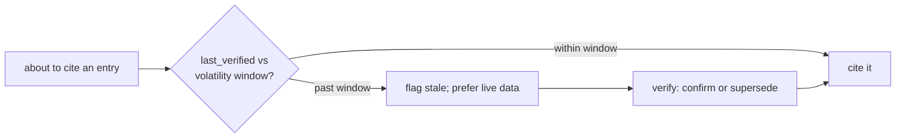
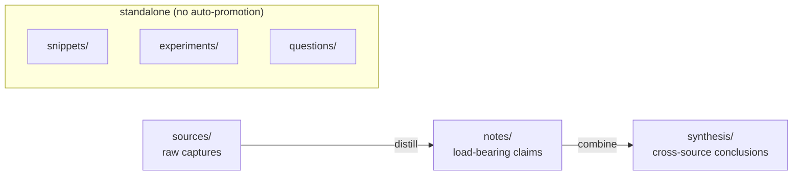

# 🗃️ research-vault

**Your coding agent guesses about your stack from a year-old training cutoff — then forgets whatever you taught it the moment the session ends.**

`research-vault` gives the agent in your repo a knowledge base it runs itself: it searches what you've already learned about the exact tools you use, cites it, and checks whether each fact is still current before leaning on it. Bind it to a project and your agent stops hallucinating about your dependencies and starts working from notes you actually trust.

- **It stops guessing.** Point a repo at a vault and the agent answers from your curated, current notes on *your* stack — not its training-cutoff memory.
- **You can delegate.** Every fact carries a freshness check, so the agent's research is trustworthy enough to build on without re-verifying by hand.
- **It compounds.** Research you do once stays. Session N+1 is smarter than N, instead of starting from zero.

It isn't a code indexer and doesn't replace Claude's view of your repo. It's the layer for *external* facts — docs, API behaviors, tool-version claims, and the decisions you made because of them — the stuff that otherwise evaporates into chat history.

Plain Markdown, zero dependencies, no human in the loop. Works in Claude Code or any other agent.


---

## See it work

```text
You:    digging into vcluster sleep mode — capture https://docs.vcluster.com/sleep-mode
Claude: Captured · vcluster 0.20 · topics: kubernetes, vcluster, cost-optimization

  …four months later, a brand-new session…

You:    how does vcluster sleep mode work again?
Claude: From your vault (vcluster 0.20 · last verified 4 months ago):
        sleep mode scales idle workloads to zero and wakes them on demand…
        ⚠ fast-moving and past its 90-day window — want me to re-verify against the live docs first?
```

You captured once. Months later, in a fresh session, the knowledge is right there — and the agent flags on its own that it might have aged. No re-research, no silently-stale citation.

## What your agent does for you

| | |
|---|---|
| 🧠 **Refuses to trust a stale fact** | Before citing, the agent weighs each entry's `volatility` tier against when it was last verified, and prefers live data when something's aged. The thing a plain notes folder can't do. |
| 🎯 **Works from your stack, not its training data** | Bind a repo to a vault and the agent answers from your curated notes on the exact tools you use — not a frozen, year-old guess about them. |
| 🔬 **Runs whole research tasks** | Ask a fresh question and `/research` answers from the vault when it can; otherwise it fans out to the web and lands every source, note, snippet, and open question as vault entries — not a throwaway report. |
| 🗂️ **Tracks versions as siblings** | `vcluster 0.19` and `0.20` both stay valid. A new release is *new knowledge*, not a correction of the old. |
| 🔍 **Searches without re-reading** | A derived manifest gives one-read facet search and a backlink graph across the whole vault. The agent finds what it needs without re-opening files. |
| 🔌 **Runs under any agent** | A Claude Code plugin *and* a standalone CLI. Codex, Gemini, or a bare file-reading agent all work — every vault is self-describing via a generated `AGENTS.md`. |
| 🪶 **Adds nothing to install** | Node ≥18, stdlib only. Zero dependencies. Runs on Linux, macOS, and Windows. |

## Why freshness is the whole game

Delegating research to an agent only works if you can trust what it gives back. The moment a citation might be silently stale, you're back to verifying everything by hand — and the agent has saved you nothing. `research-vault` is a cache **with an expiry policy**: a 2009 algorithm is still true, but a "current best model" claim from last quarter probably isn't, and the vault knows the difference. That's what makes the agent's research safe to build on instead of something you re-check.



## Install

**As a Claude Code plugin** — then just *talk to it*; no commands required (the usage skill auto-activates on technical-research questions):

```text
/plugin marketplace add https://github.com/andrew-brooks-GA/research-vault.git
/plugin install research-vault@research-vault
/reload-plugins
```

Explicit slash commands are available too: `/research-vault:research-capture`, `…:research-search`, `…:research-verify`, `…:research-lint`, `…:research-related`, `…:research-init`, `…:research-advise`, `…:research-compile`, `…:research-obsidian`, `…:research`.

**Standalone** — clone and run; no install, no dependencies:

```text
node bin/research-vault.mjs init        # scaffold a vault (prints the env-var setup line)
node bin/research-vault.mjs capture --type source --title "vcluster sleep mode" \
  --url https://docs.vcluster.com/... --domain systems-infrastructure \
  --topics kubernetes,vcluster,cost-optimization --subject-name vcluster --subject-version 0.20
node bin/research-vault.mjs search --topic vcluster
```

## Two ways to use it

Most people mix them:

- **Prose / skill-activated (default in Claude Code).** Just talk to your agent. The `research-vault-usage`, `research-capture`, `research-verify`, and `research-librarian` skills auto-activate on technical-research questions. `research-orchestrate` takes over a fresh research task end-to-end — vault-first, then web fan-out with every source and conclusion captured as entries. `research-authoring` fires when a citation is about to land in prose you're writing in a vault-bound repo, and `research-review` drives a retroactive audit of an existing doc or corpus. They describe the procedure and shell out to the fast-path commands, degrading to plain glob/grep when Node isn't present. Reading, searching, citing-with-freshness, and guided capture/verify all happen this way.
- **Manual (slash commands / CLI).** Run an operation deterministically yourself: `/research-capture`, `node bin/research-vault.mjs lint --check`, and so on.

Most operations **can be driven entirely by prose** — the command is just the faster, safer path. A few **require a command**; prose can't substitute, by design:

| Requires a command | Why prose can't do it |
|---|---|
| `lint` / `lint --check` | The single authoritative correctness gate (CI / pre-commit). Correctness must be *checked*, not asserted. |
| `init` | Scaffolds the vault and generates `AGENTS.md` from the schema. |
| `refresh` | Network re-fetch, **double-gated** (`RESEARCH_VAULT_ALLOW_NETWORK=1` **and** the subcommand). A deliberate consent control. |
| `export` | Data egress; bodies are **double-gated** (`--include-bodies` **and** `--ack-data-egress`). |

## How it's organized

Two facet tiers keep retrieval clean as the vault grows to hundreds of entries:

- **`domain`** — a small, controlled set of broad areas: `software-engineering` · `systems-infrastructure` · `data-ml` · `security` · `learning` · `llm-assisted-dev` · `meta`.
- **`topics`** — freeform; where specific tech lives (`kubernetes`, `vcluster`, `istio`, `helm`, …). Research a hundred tools without ever editing the schema.

### What goes where

| Folder | What it holds | You create one when… |
|---|---|---|
| `sources/` | Raw captures of external material: articles, papers, docs, talks (what it says, as-is) | you clip something worth keeping |
| `notes/` | Your **distilled** take on one or more sources: the load-bearing claims + how you'd use them | you read a source and want a durable, skimmable version *(deliberate — capturing a source does not auto-create a note)* |
| `synthesis/` | **Cross-source themes** combining several notes/sources into a conclusion | you see a pattern across multiple entries worth stating once |
| `snippets/` | Reusable, ideally tested code or prompt fragments | you have a fragment you'll reuse |
| `experiments/` | Logged trial runs (an LLM/tool run) with task, parameters, and outcome | you run a trial worth recording |
| `questions/` | Open questions driving research (`open → investigating → answered`) | you hit a question to track and answer over time |

The spine is a deliberate distillation flow (**`sources/` → `notes/` → `synthesis/`**) that you (or the agent, on request) walk explicitly; nothing auto-promotes. `snippets/`, `experiments/`, and `questions/` stand alone.



To change the controlled vocabulary, you edit exactly **one file**: `schema/taxonomy.json`. The linter, `capture`, the generated `AGENTS.md`, and each vault's copied `taxonomy.json` all derive from it. Nothing to keep in sync by hand.


*The vault as a navigable graph in Obsidian. Regenerate the view with `research-vault obsidian`, then open the `_obsidian/` folder (see each vault's `meta/obsidian-view.md`).*

## Where the vault lives

Tooling and data are separate; your notes never live in this repo. The vault is discovered in order: `--vault` flag → a repo's `.research-vault.json` (project binding, see below) → `$RESEARCH_VAULT_PATH` → the config pointer → OS default (`~/.local/share/research-vault` on Linux, `~/Library/Application Support/research-vault` on macOS, `%LOCALAPPDATA%\research-vault` on Windows).

### Binding a repo to a vault

This is what makes the agent work from *your* stack. Commit a `.research-vault.json` at a repo's root (`init` writes one for you) and three things compose into a write/consume loop around that repo:

- **Discovery** — every command run from inside the repo resolves to the bound vault automatically, no `--vault` flag or env var needed. The agent answers from your curated notes by default.
- **`research-authoring`** — when you're writing prose in the repo and a citation is about to land, the skill consults the vault, captures what's missing, and verifies freshness first.
- **`check`** — audits the repo's docs against the vault, reporting each citation as `ok` / `stale` / `uncovered`; `check --check` exits non-zero to gate the repo's own CI on stale or uncovered citations.

## Commands

The full CLI. In Claude Code your agent calls most of these for you; this is the reference for when you want to run one yourself.

| Command | Does |
|---|---|
| `init` | Scaffold a spec-conformant vault; generate its `AGENTS.md`. |
| `capture` | Add an entry with correct frontmatter; dedupe by URL + version. Optional: `--scaffold` (per-type body skeleton), `--content-file` / `--captured-via` (local provenance), `--store-body` (requires `--ack-data-egress`). `--batch <plan.json>` captures an ordered set atomically (validate all, then write all; duplicates reported as skipped). `--body-file` writes author prose for non-source types. |
| `lint` | Validate the vault (the correctness floor) and rebuild the manifest. `--fix` normalizes safely. |
| `verify` | List stale entries; record a verification; supersede or note version succession. |
| `search` | Facet/text query over the manifest (`--domain`, `--topic`, `--series`, `--text`, `--body`). |
| `related` | Forward links + computed backlinks for an entry (`--format mermaid`). |
| `manifest` | Rebuild/print the derived index. |
| `compile` | Regenerate a git-ignored `_index/` human-readable index (grouped by type); a derived cache, never a source of truth. |
| `advise` | Read-only curation report: stale entries, orphans, sources lacking a note, **unverified (captured-only) sources**, aliasable topics, **stub bodies**. Never mutates. |
| `obsidian` | Regenerate a git-ignored `_obsidian/` wikilink view + Map-of-Content; never mutates canonical entries. |
| `refresh` | Re-check source freshness over the network (off by default, double-gated). Reports `confirmed`/`changed`/`unreachable`; never mutates entries. |
| `export` | Read-only JSONL for external finetuning/eval: by default only answered-question `{input, output}` pairs; `--scope <types>` widens to other types' title + `summary` field, and bodies need `--include-bodies --ack-data-egress`. See [`docs/FINETUNING.md`](docs/FINETUNING.md). |
| `check` | Audit a document/glob **outside** the vault: report each citation (external URL or vault id) as `ok` / `stale` / `uncovered` against the manifest. `--report` / `--json` emit a coverage matrix; `--check` exits non-zero to gate a consuming repo's CI. Read-only, no network. |

## Safety: network & egress

Everything is local and read-only by default. Exactly two features reach outside the vault, and both are off or conservative until you opt in per run — neither ever mutates your entries:

- **`refresh`** (network) re-fetches a source's URL to check whether it changed, comparing content hashes only and never storing the fetched page. It's double-gated: the `refresh` subcommand *and* `RESEARCH_VAULT_ALLOW_NETWORK=1`. Reach for it before relying on an older source, then run `verify` on anything that came back `changed`.
- **`export`** (file egress) writes a stable JSONL file for a fine-tuning or eval pipeline — answered-question `{input, output}` pairs only, by default. Full bodies are double-gated behind `--include-bodies --ack-data-egress`.

The full contract, including the SSRF hardening and double-gating rules, is in [`SECURITY.md`](SECURITY.md).

## Team use

A vault is just a folder of Markdown, so a **shared team knowledge base** is a vault kept in a git repo. Everyone's agent reads the same `AGENTS.md`, so the whole team searches, cites, and verifies against one freshness-governed source of truth instead of re-researching in private silos.

To set one up: commit the entries, `taxonomy.json`, and the generated `AGENTS.md`. The derived caches (`.vault-manifest.json`, `_index/`, `_obsidian/`) are git-ignored by the bundled `vault-template/.gitignore` and rebuilt locally with `lint` / `compile`. Run `lint --check` in CI or a pre-commit hook as the shared correctness gate — that lint floor, not a server, is what keeps a multi-writer vault consistent.

## Design notes

- **Cache, not source of truth.** Staleness is the dominant failure mode of agent research; this vault makes it visible and actionable.
- **Lint is the guarantee, not the hook.** Correctness lives in `lint` (runs anywhere, on any writer). `capture`/`verify` self-heal; the plugin ships two advisory Claude Code hooks (a `PostToolUse` lint-fix and a `SessionStart` vault summary), both non-blocking and non-load-bearing (convenience only).
- **Everything human-facing is generated.** `AGENTS.md` and the per-vault `taxonomy.json` are generated from the schema at `init`; CI checks the generator against a committed golden snapshot (`schema/AGENTS.golden.md`), and an existing vault refreshes its copies with `init --refresh-docs` (regenerates `AGENTS.md` + `taxonomy.json` only — never entries or `meta/`).
- **Orchestration ships as a reference implementation, contracted for others.** The `research-orchestrate` skill (`/research`) drives vault-first research with eager source capture and an atomic `capture --batch` for the distilled layers. Third-party orchestration skills compose the same way — see [`docs/ORCHESTRATOR-INTEGRATION.md`](docs/ORCHESTRATOR-INTEGRATION.md) for the lifecycle boundary, the capture-plan checklist, and the two lint warnings that make non-conforming output visible.
- **Migrating existing notes?** See [`docs/MIGRATION.md`](docs/MIGRATION.md) for moving an existing folder of entries into a managed vault.

## Development

```text
npm test     # node --test — unit + integration, zero test-framework deps
```

CI runs the suite plus `init` / `lint --check` / AGENTS.md-anti-drift / encoding gates across **{Linux, macOS, Windows} × Node {18, 20, 22}**.

## License

[MIT](LICENSE) © Andrew Brooks